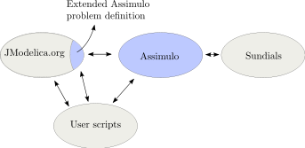
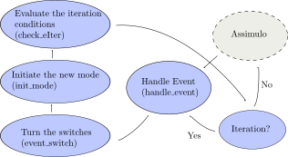

================================
Assimulo for JModelica.org users
================================

Assimulo has been incorporated into the JModelica.org platform as the default simulation package. This has been made possible by extending Assimulo's problem classes where the JModelica.org JMI model is modified and adapted to Assimulo. In the Figure below the connection between JModelica.org, Assimulo and
Sundials are displayed.

When using Assimulo together with JModelica.org and the new high-level simulation methods, all the parameters passed in the *solver_args*-dict represents parameters for the specific solver used in Assimulo. ::
 
    def simulate(self, 
                 algorithm=AssimuloAlg, 
                 alg_args={}, 
                 solver_args={}):

A list of the different solver specific parameters can be found in the :doc:`usage` section.

Discontinuous Systems
--------------------------

In the new release of `JModelica.org <http://www.jmodelica.org/story/237>`_ support for if-constructs were implemented which is also supported in the Assimulo solvers :doc:`IDA <solver_imp_IDA>` and :doc:`CVode <solver_exp_CVode>`. 

.. note::

    The extended problem definitions in JModelica.org is currently only extended to handle *if*-constructs together with the solver IDA. 

But as Assimulo just reports the events, and gives control back to the user via the method *handle_event* in the problem, an event handling had to be defined in JModelica.org. In the Figure below an overview of the event handling in JModelica.org is depicted.

When Assimulo finds an event, the control is given to *handle_event* which enters an event iteration loop. In this loop the switches are turned according to the information provided by Assimulo about which event indicator have fired. After turning the switches the new mode corresponding to the new switches are initiated according to Sundials option `'IDA_YA_YDP_INIT' <https://computation.llnl.gov/casc/sundials/documentation/ida_guide/node5.html#SECTION00554000000000000000>`_ which is implemented by use of :class:`IDA.make_consistent <assimulo.implicit_ode.IDA.make_consistent>` . After the initiation the iteration conditions are evaluated, which checks for if the initiation triggered another event in which case the loop continues. If the initiation does not trigger another event, the simulation continues.

Also, the event handling is dependent on *moving* the event indicators a small epsilon depending on if they are in the upper region or in the lower region.

This handling of the events introduces some extra parameters that can be passed down in the *solver_args*-dict.

    - *max_eIter*, Maximum number of event iterations allowed.
    - *eps*, Value used for adjusting the event indicators

