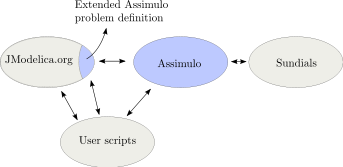

================================
Assimulo for JModelica.org users
================================

Assimulo has been incorporated into the JModelica.org platform as the default simulation package. This has been made possible by extending Assimulo's problem classes where the JModelica.org JMI model and FMU model is modified and adapted to Assimulo. In the Figure below the connection between JModelica.org, Assimulo and
Sundials are displayed.

When using Assimulo together with JModelica.org and the new high-level simulation methods, all the parameters passed in the *options*-dict represents parameters for the specific solver used in Assimulo. ::
 
    FMUModel(ME1/ME2).simulate(self, 
                        start_time=0.0,
                        final_time=1.0,
                        input=(),
                        algorithm='AssimuloAlg', 
                        options={}):

A list of the different solver specific parameters can be found in the :doc:`usage` section. A more detailed description of the available options and interface between JModelica.org and Assimulo can be found in the JModelica.org users guide.
