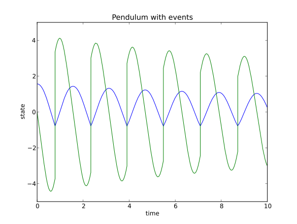

Discontinuous problems (CVode)
===============================

State depending discontinuities
-------------------------------

Discontinuities (or discontinuities in higher derivatives) can have a negative effect on the performance of ODE and DAE solvers, 
when no care is taken to stop the integration at discontinuities and to re-initialize the simulation. 
This part of the tutorial will show how to use the solver CVode together with a problem with discontinuities.

For detecting discontinuities a method called ``state_events`` (can also be called event function or root function) 
needs to be specified by the user. This method describes a vector valued function :math:`q` 

.. math::

	q: \mathbb{R}^{n_y+1} \rightarrow \mathbb{R}^{n_s} \textrm{ with } (t,y) \mapsto q(t,y)

in such a way, that the :math:`i\mathrm{th}` component of the returned vector crosses zero exactly at the time point, where the :math:`i\mathrm{th}` event occurs.

The view on discontinuous problems is, that we have different differential equations (models), which describe the physical problems
on different subintervals of the simulation interval. Those subintervals are often not known in advanced. Which model actually is 
used depends on the values of a Boolean vector of switches ``sw``. Therefor 
rhs method is extended by an additional input parameter::

    def rhs(t,y,sw):
        ...
        
which is used to indicade which model ahes to me used in the sequel. The ``state_event`` method is defined as, ::

    def state_events(t,y,sw):
        ...

i.e. it might also depend on the values of the switches.

During the simulation the state event method is checked for zero crossings, caleld an event. At such an event the simulation is interrupted and control is given 
to a user specified method ``handle_event``, ::

    def handle_event(solver, event_info):
        ...
        
``solver`` is the current solver object (CVode) and ``event_info`` contains information about the occurred event: which of the equations in state events have crossed zero and also in which "way" (1 or -1). 

``event_info`` is a tuple. Its first component is a list, which informs about state events::

    event_info[0] #State Events, list of [1,0,0,-1], !=0 means an event occurred.

A value +1 indicates that the ``state_event`` function crossed zero from negative to positive and a value -1 indictes that the 
function became negative in the respective component.

Example
------------------

This example demonstrates a free pendulum which bounces against an object situated at an angle of -45 degrees. The rhs is given below, ::

    def pendulum(t,y,sw):
        """
        The ODE to be simulated. The parameter sw should be fixed during 
        the simulation and only be changed during the event handling.
        """
        l=1.0
        g=9.81
        yd_0 = y[1]
        yd_1 = -g/l*N.sin(y[0])
            
        return N.array([yd_0, yd_1])

During the simulation, the pendulum has to be monitored and checked to see when it hits the wall. The wall is situated at an angle of -45 degrees which gives the following event functions,

.. math::
    
    q(t,y)=y+\frac{\pi}{4} 
    
and in Python code, ::

    def state_events(t,y,sw):
        """
        This is the function that keeps track of  events. When the sign
        of any of the functions changed, we have an event.
        """
        if sw[0]:
            e_0 = y[0]+N.pi/4.
        else:
            e_0 = y[0]

        return N.array([e_0])

Notice how the event function changes depending on the value of the switch ``sw``. The idea here is that when the pendulum bounces, the event function is deactivated until it has reached the lowest most point where it is activated again. This is mainly to show how to use the switches for changing between modes of the problem. The method that actually changes the vector of switches is the method for handling the events, ::

    def handle_event(solver, event_info):
        """
        Event handling. This functions is called when Assimulo finds an event as
        specified by the event functions.
        """
        state_info = event_info[0] #We are only interested in state events 

        if state_info[0] != 0: #Check if the first event function has been triggered
            
            if solver.switches[0]: #If the switch is True the pendulum bounces
                solver.y_cur[1] = -0.9*solver.y_cur[1] #Change the velocity and lose energy
                
            solver.switches[0] = not solver.switches[0] #Change event function

As seen from the method, we are only interested in the state events so that information is retreived from the event information. Then there is a check to see if the first state event function has been triggered. If the switches are ``True``, there should be a bounce with some energy loss. If the switches are ``False``, the state event equation for the bounce is reactivated.

.. note::

    If the event handling changes the values of the states, the values to set to solver object are ::
    
        solver.y_cur (states)
        solver.yd_cur (state derivatives)

Next, we create the problem as before, with the only difference that we also sets the state events and the handle event function.::

    #Create an Assimulo Problem
    mod = Explicit_Problem()
        
    mod.f = pendulum                #Sets the rhs to the problem
    mod.state_events = state_events #Sets the state events to the problem
    mod.handle_event = handle_event #Sets the event handling to the problem
    mod.problem_name = 'Pendulum with events'   #Sets the name of the problem

Sets the initial conditions, ::

    #Initial values
    y0 = [N.pi/2.0, 0.0] #Initial states
    t0 = 0.0             #Initial time
    switches0 = [True]   #Initial switches

Create the solver, ::

    #Create an Assimulo solver (CVode)
    sim = CVode(mod, y0, t0,switches0)
    
options, ::

    #Specifies options 
    sim.discr = 'Adams'     #Sets the discretization method
    sim.iter = 'FixedPoint' #Sets the iteration method
    sim.rtol = 1.e-8        #Sets the relative tolerance
    sim.atol = 1.e-6        #Sets the absolute tolerance
    
and simulate, ::

    #Simulation
    ncp = 200     #Number of communication points
    tfinal = 10.0 #Final time
    
    sim.simulate(tfinal, ncp) #Simulate

The information is retrieved below, ::    

    #Simulation info
    sim.plot()              #Plot
    sim.print_event_info()  #Print the event statistics

The plot is given below,

together with the statistics. ::

    Final Run Statistics: Pendulum 

     Number of Error Test Failures             = 32
     Number of F-Eval During Jac-Eval          = 0
     Number of Function Evaluations            = 1057
     Number of Jacobian Evaluations            = 0
     Number of Nonlinear Convergence Failures  = 0
     Number of Nonlinear Iterations            = 1005
     Number of Root Evaluations                = 852
     Number of Steps                           = 542

    Solver options:

     Solver                  :  CVode
     Linear Multistep Method :  Adams
     Nonlinear Solver        :  FixedPoint
     Maxord                  :  12
     Tolerances (absolute)   :  1e-06
     Tolerances (relative)   :  1e-08

    Elapsed simulation time: 0.07 seconds.

To print the information about occurred events, use the method ::

    sim.print_event_info()
    
Which prints. ::

    Time, t = 7.795455e-01
      Event info,  [array([-1], dtype=int32), False]
    Time, t = 9.832278e-01
      Event info,  [array([1], dtype=int32), False]
    Time, t = 2.336937e+00
      Event info,  [array([-1], dtype=int32), False]
    Time, t = 2.557287e+00
      Event info,  [array([1], dtype=int32), False]
    Time, t = 3.903297e+00
      Event info,  [array([-1], dtype=int32), False]
    Time, t = 4.140730e+00
      Event info,  [array([1], dtype=int32), False]
    Time, t = 5.485753e+00
      Event info,  [array([-1], dtype=int32), False]
    Time, t = 5.740509e+00
      Event info,  [array([1], dtype=int32), False]
    Time, t = 7.089164e+00
      Event info,  [array([-1], dtype=int32), False]
    Time, t = 7.361300e+00
      Event info,  [array([1], dtype=int32), False]
    Time, t = 8.716798e+00
      Event info,  [array([-1], dtype=int32), False]
    Time, t = 9.006180e+00
      Event info,  [array([1], dtype=int32), False]
    Number of events:  12

For the complete example, :download:`tutorialCVodeDisc.py`
