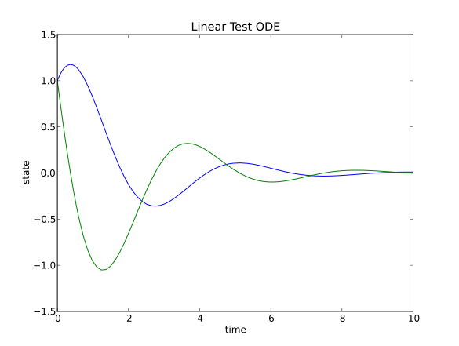

###############
Tutorial
###############

    - :ref:`tutIntro`
    - :ref:`tutExplicit`
    - :ref:`tutImplicit`
    - :ref:`tutDisc`
    - :ref:`tutAdd`

.. _tutIntro:

Introduction
===============

This tutorial will give a short introduction of using the Assimulo package for solving both explicit and implicit ordinary differential equations. The tutorial will focus on the solvers IDA and CVode which is part of the SUNDIALS package written in C. In Assimulo these solvers have been lifted to Python to provide an easy interface and an easy platform for experimenting.

   - This tutorial is intended to be a short introduction for students taking the course `FMNN05 <http://www.maths.lth.se/na/courses/FMNN05/>`_ at `Lund University <http://www.lu.se/>`_ , Lund, Sweden. 
   

.. note::

    - The SUNDIALS code are left unchanged.
    - Not all of SUNDIALS parameters are currently lifted to Python.
    
    See also the original `SUNDIALS <http://computation.llnl.gov/casc/sundials/main.html>`_ documentation

.. note::

    If there are any questions about a method or class, it is recommended to have a look at the docstrings using for example IPython. The docstrings are viewed using a question mark (?) after the method/class. Example, ::
    
        CVode.atol?

.. _tutExplicit:

Explicit Problems (Commonly ODEs)
=================================

In the next few sections it will be shown how the use the solver CVode to solve an explicit ordinary differential equation (commonly ODE) on the form,

.. math::

    \dot{y} = f(t,y), \quad y(t_0) = y_0

Problem formulation
-----------------------

The problem consists of a 'right-hand-side' (in the ODE case) together with initial conditions for the time and the states. The 'right-hand-side' takes as input the time (t) and the states (y) and returns the calculated state derivatives (yd).

An example of a rhs is shown below (Python)::

    import numpy as N

    def rhs(t,y):
        A =N.array([[0,1],[-2,-1]])
        yd=N.dot(A,y)
        
        return yd

The initial conditions to the rhs needs to also to be specified::

    y0=N.array([1.0,1.0])
    t0=0.0

Creating an Assimulo solver
------------------------------

Having defined the differential equation together with a set of initial conditions, lets create a solver object for the problem. But in order to create a solver object a problem object is needed, which is a class from the Assimulo package where a user specifies the problem. ::
    
    from assimulo.problem import Explicit_Problem #Imports the problem formulation from Assimulo
    
    model = Explicit_Problem()             #Create an Assimulo problem
    model.f = rhs                          #This is how the rhs connects to the Assimulo problem
    model.problem_name = 'Linear Test ODE' #Specifies the name of problem (optional)
    
And now to create the actual solver object::

    from assimulo.explicit_ode import CVode #Imports the solver CVode from Assimulo

    sim = CVode(model, y0, t0)

Simulate
----------

To simulate the problem using the default values, simply specify the final time of the simulation and simulate::

    tfinal = 10.0        #Specify the final time
    
    sim.simulate(tfinal) #Use the .simulate method to simulate and provide the final time
    
This will give all sorts of information in the prompt, the statistics of the solver, how many function calls was needed, among others. Also information about the solver, which options the problem was solved with. The *simulate* method can also take the number of communication points for which the solution should be returned. This is specified by a second argument to *simulate*, *simulate(tfinal,200)*. Which means that the result vector should contain 200 equally spaced points.

To plot the simulation result, use the plot method::

    sim.plot() #Plots the result
    
The plot is given below,

together with the statistics. ::

    Final Run Statistics: Linear Test ODE 

     Number of Error Test Failures             = 4
     Number of F-Eval During Jac-Eval          = 0
     Number of Function Evaluations            = 153
     Number of Jacobian Evaluations            = 0
     Number of Nonlinear Convergence Failures  = 0
     Number of Nonlinear Iterations            = 149
     Number of Root Evaluations                = 0
     Number of Steps                           = 84

    Solver options:

     Solver                  :  CVode
     Linear Multistep Method :  Adams
     Nonlinear Solver        :  FixedPoint
     Maxord                  :  12
     Tolerances (absolute)   :  1e-06
     Tolerances (relative)   :  1e-06

    Elapsed simulation time: 0.0 seconds.

For the complete example, :download:`tutorialCVode.py`

Setting options and parameters
-------------------------------------

To control the integration, SUNDIALS provide a number of parameters and options which of a few have been lifted up to Python.

Here are some:

    - **atol** The absolute tolerance. This controls the global error increment in every step. It can be set as a scalar or (preferably) as a vector, which defines the absolute tolerance for every solution component.
    
    - **rtol** The relative tolerance. It is a scalar.
    
    - **maxord** The maximal order. It cannot exceed 12 in case of Adams methods or 5 in case of BDF.
    
    - **discr** The discretization method, Adams or BDF. (Only for CVode)
    
    - **iter** The type of corrector iteration, FixedPoint or Newton (Only for CVode)

Example.::

    sim.atol=N.array([1.0,0.1])*1.e-5
    sim.rtol=1.e-8
    sim.maxord=3
    sim.discr='BDF'
    sim.iter='Newton'

For the full range of available options see each solver, for example `CVode <solver_CVode.html>`_ or `IDA <solver_IDA.html>`_ .

.. _tutImplicit:

Implicit Problems (Commonly DAEs)
=================================

In the next few sections it will be shown how to use the solver IDA to solve an implicit ordinary differential equation (commonly DAE) on the form,

.. math::

    0 = F(t,y,\dot{y}),\quad y(t_0) = y_0,\quad \dot{y}(t_0) = \dot{y_0}

Problem formulation
----------------------

The problem consists of a residual function (f) together with initial values for the time, states and state derivatives. The residual takes as input time (t), state (y) and state derivative (yd) and returns a vector. Also the initial conditions should be consistent, meaning that the residual should return a zero vector for the initial values.

An example of a residual is shown below (Python)::

    import numpy as N

    def residual(t,y,yd):
        
        res_0 = yd[0]-y[2]
        res_1 = yd[1]-y[3]
        res_2 = yd[2]+y[4]*y[0]
        res_3 = yd[3]+y[4]*y[1]+9.82
        res_4 = y[2]**2+y[3]**2-y[4]*(y[0]**2+y[1]**2)-y[1]*9.82

        return N.array([res_0,res_1,res_2,res_3,res_4])

The initial conditions to the residual needs also to be specified::

    #The initial conditions
    t0  = 0.0 #Initial time
    y0  = [1.0, 0.0, 0.0, 0.0, 0.0] #Initial conditions
    yd0 = [0.0, 0.0, 0.0, -9.82, 0.0] #Initial conditions

Creating an Assimulo solver
------------------------------

Having defined the differential equation together with a set of initial conditions, lets create a solver object for the problem. But in order to create a solver object a problem object is needed, which is a class from the Assimulo package where a user specifies the problem. ::
    
    from assimulo.problem import Implicit_Problem #Imports the problem formulation from Assimulo
    
    model = Implicit_Problem()             #Create an Assimulo problem
    model.f = residual                     #This is how the residual connects to the Assimulo problem
    model.problem_name = 'Pendulum'        #Specifies the name of problem (optional)
    
And now to create the actual solver object::

    from assimulo.implicit_ode import IDA #Imports the solver IDA from Assimulo

    sim = IDA(model, y0, yd0, t0)

Simulate
----------

To simulate the problem using the default values, simply specify the final time of the simulation and the number of communication points and simulate::

    tfinal = 10.0        #Specify the final time
    ncp = 500            #Number of communication points (number of return points)
    
    sim.simulate(tfinal, ncp) #Use the .simulate method to simulate and provide the final time and ncp (optional)
    
This will give all sorts of information in the prompt, the statistics of the solver, how many function calls was needed, among others. Also information about the solver, which options the problem was solved with.

To plot the simulation result, use the plot method::

    sim.plot() #Plots the result
    
The plot is given below,

.. image:: tutorialIDAPlot.svg
   :align: center
   :scale: 50 %

together with the statistics. ::

    Final Run Statistics: Pendulum 

     Number of Error Test Failures             = 30
     Number of F-Eval During Jac-Eval          = 385
     Number of Function Evaluations            = 1967
     Number of Jacobian Evaluations            = 77
     Number of Nonlinear Convergence Failures  = 0
     Number of Nonlinear Iterations            = 1967
     Number of Root Evaluations                = 0
     Number of Steps                           = 1443

    Solver options:

     Solver                :  IDA (BDF)
     Maxord                :  5
     Suppress Alg          :  False
     Tolerances (absolute) :  1e-06
     Tolerances (relative) :  1e-06

    Elapsed simulation time: 0.16 seconds.

For the complete example, :download:`tutorialIDA.py`

.. _tutDisc:

Discontinuity problems (CVode)
===============================

Discontinuities (or discontinuities in higher derivatives) can have a negative effect on the performance of ODE and DAE solvers, when no care is taken to stop the integration at discontinuities and to re-initialize the simulation. This part of the tutorial will show how to use the solver CVode together with a problem with discontinuities.

For detecting discontinuities a method called state events (can also be called event function or root function) needs to be specified by the user. This method should contain the information about the discontinuit(y/ies) and be defined to return a vector of all the current values of the equations and when one of the equations return zero, an event have been detected. 

When simulation models with discontinuities, the rhs method is extended with another input called the switches (sw)::

    def rhs(t,y,sw):
        ...
        
which can be used to switch between different modes of the problem. The switches are a vector of booleans. The state event method is defined as, ::

    def state_events(t,y,sw):
        ...

During the simulation the state event method is checked for zero crossings and at an event the simulation is aborted and return control to a user specified method *handle_event*, ::

    def handle_event(solver, event_info):
        ...
        
The solver is the current solver object (CVode) and the event_info contains information about the occurred event, which of the equations in *state_events* have crossed zero and also which "way" (1 or -1) together with information about time events, which we leave for now. The state event information are stored in::

    event_info[0] #State Events, list of [1,0,0,-1], !=0 means an occurred event.

Example
------------------

This example demonstrates a free pendulum which bounces against an object situated at an angle of -45 degrees. The rhs is given below, ::

    def pendulum(t,y,sw):
        """
        The ODE to be simulated. The parameter sw should be fixed during 
        the simulation and only be changed during the event handling.
        """
        l=1.0
        g=9.81
        yd_0 = y[1]
        yd_1 = -g/l*N.sin(y[0])
            
        return N.array([yd_0, yd_1])

During the simulation, the pendulum have to be monitored and checked to see when it hits the wall. The wall is situated at an angle of -45 degrees which gives the following event functions,

.. math::
    
    \theta+\frac{\pi}{4} > 0
    
and in Python code, ::

    def state_events(t,y,sw):
        """
        This is our function that keep track of our events, when the sign
        of any of the events has changed, we have an event.
        """
        if sw[0]:
            e_0 = y[0]+N.pi/4.
        else:
            e_0 = y[0]

        return N.array([e_0])

Notice how the event function changes depending on the value of the switch (sw). The idea here is that when the pendulum bounces, the event function is deactivated until it have reached the lowest most point where it is again activated. This is mainly to show how to use the switches for changing between modes of the problem. The method that actually changes the vector of switches is the method for handling the events, ::

    def handle_event(solver, event_info):
        """
        Event handling. This functions is called when Assimulo finds an event as
        specified by the event functions.
        """
        state_info = event_info[0] #We are only interested in state events info

        if state_info[0] != 0: #Check if the first event function have been triggered
            
            if solver.switches[0]: #If the switch is True the pendulum bounces
                solver.y_cur[1] = -0.9*solver.y_cur[1] #Change the velocity and lose energy
                
            solver.switches[0] = not solver.switches[0] #Change event function

As seen from the method, we are only interested in the state events so that information is retreived from the event information. Then there is a check to see if the first state event function have been triggered. If the switches are True, there should be a bounce with some energy loss. If the switches are False, the state event equation for the bounce should be reactivated.

.. note::

    If the event handling changes the vales of the states (or state derivatives in the DAE case) the values to set to solver object are, ::
    
        solver.y_cur (states)
        solver.yd_cur (state derivatives)

Next, we create the problem as before, with the only difference that we also sets the state events and the handle event function.::

    #Create an Assimulo Problem
    mod = Explicit_Problem()
        
    mod.f = pendulum                #Sets the rhs to the problem
    mod.state_events = state_events #Sets the state events to the problem
    mod.handle_event = handle_event #Sets the event handling to the problem
    mod.problem_name = 'Pendulum with events'   #Sets the name of the problem

Sets the initial conditions, ::

    #Initial values
    y0 = [N.pi/2.0, 0.0] #Initial states
    t0 = 0.0             #Initial time
    switches0 = [True]   #Initial switches

Create the solver, ::

    #Create an Assimulo solver (CVode)
    sim = CVode(mod, y0, t0,switches0)
    
options, ::

    #Specifies options 
    sim.discr = 'Adams'     #Sets the discretization method
    sim.iter = 'FixedPoint' #Sets the iteration method
    sim.rtol = 1.e-8        #Sets the relative tolerance
    sim.atol = 1.e-6        #Sets the absolute tolerance
    
and simulate, ::

    #Simulation
    ncp = 200     #Number of communication points
    tfinal = 10.0 #Final time
    
    sim.simulate(tfinal, ncp) #Simulate

The information is retrieved below, ::    

    #Simulation info
    sim.plot()              #Plot
    sim.print_event_info()  #Print the event statistics

The plot is given below,

.. image:: tutorialCVodeDiscPlot.svg
   :align: center
   :scale: 50 %

together with the statistics. ::

    Final Run Statistics: Pendulum 

     Number of Error Test Failures             = 32
     Number of F-Eval During Jac-Eval          = 0
     Number of Function Evaluations            = 1057
     Number of Jacobian Evaluations            = 0
     Number of Nonlinear Convergence Failures  = 0
     Number of Nonlinear Iterations            = 1005
     Number of Root Evaluations                = 852
     Number of Steps                           = 542

    Solver options:

     Solver                  :  CVode
     Linear Multistep Method :  Adams
     Nonlinear Solver        :  FixedPoint
     Maxord                  :  12
     Tolerances (absolute)   :  1e-06
     Tolerances (relative)   :  1e-08

    Elapsed simulation time: 0.07 seconds.

To print the information about occurred events, use the method ::

    sim.print_event_info()
    
Which prints. ::

    Time, t = 7.795455e-01
      Event info,  [array([-1], dtype=int32), False]
    Time, t = 9.832278e-01
      Event info,  [array([1], dtype=int32), False]
    Time, t = 2.336937e+00
      Event info,  [array([-1], dtype=int32), False]
    Time, t = 2.557287e+00
      Event info,  [array([1], dtype=int32), False]
    Time, t = 3.903297e+00
      Event info,  [array([-1], dtype=int32), False]
    Time, t = 4.140730e+00
      Event info,  [array([1], dtype=int32), False]
    Time, t = 5.485753e+00
      Event info,  [array([-1], dtype=int32), False]
    Time, t = 5.740509e+00
      Event info,  [array([1], dtype=int32), False]
    Time, t = 7.089164e+00
      Event info,  [array([-1], dtype=int32), False]
    Time, t = 7.361300e+00
      Event info,  [array([1], dtype=int32), False]
    Time, t = 8.716798e+00
      Event info,  [array([-1], dtype=int32), False]
    Time, t = 9.006180e+00
      Event info,  [array([1], dtype=int32), False]
    Number of events:  12

For the complete example, :download:`tutorialCVodeDisc.py`

.. _tutAdd:

Additional information
========================

Included in the Assimulo package there is a number of examples, showing how to use the different solvers on different types of problem. The examples are located in the examples folder.
