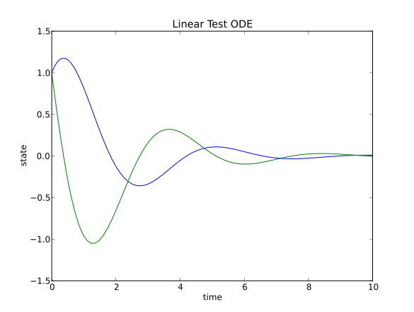

Explicit Problems (ODEs)
=================================

In the next few sections we show how to use the solver CVode for solving an explicit ordinary differential equation (ODE) on the form,

.. math::

    \dot{y} = f(t,y), \quad y(t_0) = y_0

Problem formulation
-----------------------

The problem consists of a 'right-hand-side function' :math:`f` together with initial conditions :math:`y(t_0) = y_0` for the time and the states. This has to be packed into a problem class.

The 'right-hand-side function' takes as input the time :math:`t` and the states :math:`y` and returns the calculated state derivatives :math:`\dot{y}`.

An example of a 'right-hand-side function' rhs is shown below (Python)::

    import numpy as N
    import pylab as P

    def rhs(t,y):
        A =N.array([[0,1],[-2,-1]])
        yd=N.dot(A,y)
        
        return yd

The initial conditions to the rhs need to also to be specified::

    y0=N.array([1.0,1.0])
    t0=0.0

Both, the rhs-function and the initial conditions are packed now into the problem class, being the Python equivalent to an explicit ODE::
    
    from assimulo.problem import Explicit_Problem  #Imports the problem formulation from Assimulo
    
    model = Explicit_Problem(rhs, y0, t0) #Create an Assimulo problem
    model.name = 'Linear Test ODE'        #Specifies the name of problem (optional)

Creating an Assimulo CVode solver instance
------------------------------------------
    
And now we create the actual solver object using SUNDIAL's CVode::

    from assimulo.solvers import CVode #Imports the solver CVode from Assimulo

    sim = CVode(model)

Simulate
----------

To simulate the problem using the default values, simply specify the final time of the simulation and simulate::

    tfinal = 10.0        #Specify the final time
    
    t, y = sim.simulate(tfinal) #Use the .simulate method to simulate and provide the final time
    
This returns all sorts of information in the prompt, the statistics of the solver including how many function calls were needed. Also information about the solver, which options the problem was solved with is displayed. The *simulate* method can also take the number of communication points as an argument. These are those points for which the solution values should be returned. This is specified by a second argument, e.g. *sim.simulate(tfinal,200)* which means that the result vector should be returned for 200 equally spaced time points.

The results are stored in the returned *t* and *y* variables.

To plot the simulation result, just execute::
    
   sim.plot()

or use the plot functionality from pylab::

    #Plots the result
    P.plot(t,y)
    P.show()
    
The plot is given below,

together with the statistics. ::

    Final Run Statistics: Linear Test ODE 

     Number of Error Test Failures             = 4
     Number of F-Eval During Jac-Eval          = 0
     Number of Function Evaluations            = 153
     Number of Jacobian Evaluations            = 0
     Number of Nonlinear Convergence Failures  = 0
     Number of Nonlinear Iterations            = 149
     Number of Root Evaluations                = 0
     Number of Steps                           = 84

    Solver options:

     Solver                  :  CVode
     Linear Multistep Method :  Adams
     Nonlinear Solver        :  FixedPoint
     Maxord                  :  12
     Tolerances (absolute)   :  1e-06
     Tolerances (relative)   :  1e-06

    Simulation interval    : 0.0 - 10.0 seconds.
    Elapsed simulation time: 0.0 seconds.

For the complete example, :download:`tutorialCVode.py`

Setting options and parameters
-------------------------------------

To control the integration, SUNDIALS provides a large number of parameters and options. Many of those have been lifted up to Python.

Here are some of the most important ones:

    - **atol** The absolute tolerance. This controls the global error increment in every step. It can be set as a scalar or (preferably) as a vector, which defines the absolute tolerance for every solution component.
    
    - **rtol** The relative tolerance. It is a scalar.
    
    - **discr** The discretization method, Adams or BDF. (Only for CVode)
    
    - **iter** The type of corrector iteration, FixedPoint or Newton (Only for CVode)
    
    - **maxord** The maximal order. It cannot exceed 12 in case of Adams methods or 5 in case of BDF. Note that a change of the discretization method results in that the maximum order is result to its default.
    

Example.::

    sim.atol=N.array([1.0,0.1])*1.e-5
    sim.rtol=1.e-8
    sim.maxord=3
    sim.discr='BDF'
    sim.iter='Newton'

For the full range of available options see each solver, for example `CVode <ODE_CVode.html>`_ or `IDA <DAE_IDA.html>`_ .
