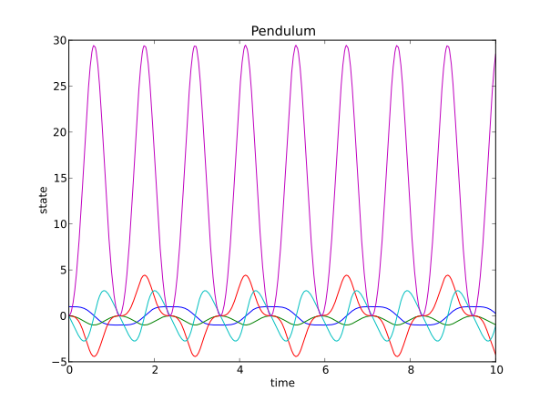

Implicit Problems (Commonly DAEs)
=================================

In the next sections we show how to use the solver IDA to solve an implicit ordinary differential equation (commonly DAE) on the form,

.. math::

    0 = F(t,y,\dot{y}),\quad y(t_0) = y_0,\quad \dot{y}(t_0) = \dot{y_0}

Problem formulation
----------------------

The problem consists of a residual function (F) together with initial values for the time, states and state derivatives. 
The residual takes as input time (t), state (y) and state derivative (yd) and returns a vector. 

The initial data should be consistent, i.e. the residual should return a zero vector when called with these values.

An example of a residual is shown below (Python)::

    import numpy as N

    def residual(t,y,yd):
        
        res_0 = yd[0]-y[2]
        res_1 = yd[1]-y[3]
        res_2 = yd[2]+y[4]*y[0]
        res_3 = yd[3]+y[4]*y[1]+9.82
        res_4 = y[2]**2+y[3]**2-y[4]*(y[0]**2+y[1]**2)-y[1]*9.82

        return N.array([res_0,res_1,res_2,res_3,res_4])

The initial conditions to the residual need also to be specified::

    #The initial conditions
    t0  = 0.0 #Initial time
    y0  = [1.0, 0.0, 0.0, 0.0, 0.0] #Initial states
    yd0 = [0.0, 0.0, 0.0, -9.82, 0.0] #Initial state derivatives
    
All this is packed into an Assimulo problem class:

    from assimulo.problem import Implicit_Problem #Imports the problem formulation from Assimulo
    
    model = Implicit_Problem()             #Create an Assimulo problem
    model.f = residual                     #This is how the residual connects to the Assimulo problem
    model.problem_name = 'Pendulum'        #Specifies the name of problem (optional)
    model.y0 = y0
    model.yd0 = yd0   

Creating an Assimulo solver
------------------------------

And now to create the actual solver object::

    from assimulo.implicit_ode import IDA #Imports the solver IDA from Assimulo

    sim = IDA(model, t0)

Simulate
----------

To simulate the problem using the default values, simply specify the final time of the simulation and the number of communication points and simulate::

    tfinal = 10.0        #Specify the final time
    ncp = 500            #Number of communication points (number of return points)
    
    sim.simulate(tfinal, ncp) #Use the .simulate method to simulate and provide the final time and ncp (optional)
    
This will give all sorts of information in the prompt, the statistics of the solver, how many function calls were needed, among others. Also information about the solver, which options the problem was solved with.

To plot the simulation result, use the plot method::

    sim.plot() #Plots the result
    
The plot is given below,

together with the statistics. ::

    Final Run Statistics: Pendulum 

     Number of Error Test Failures             = 30
     Number of F-Eval During Jac-Eval          = 385
     Number of Function Evaluations            = 1967
     Number of Jacobian Evaluations            = 77
     Number of Nonlinear Convergence Failures  = 0
     Number of Nonlinear Iterations            = 1967
     Number of Root Evaluations                = 0
     Number of Steps                           = 1443

    Solver options:

     Solver                :  IDA (BDF)
     Maxord                :  5
     Suppress Alg          :  False
     Tolerances (absolute) :  1e-06
     Tolerances (relative) :  1e-06

    Elapsed simulation time: 0.16 seconds.

For the complete example, :download:`tutorialIDA.py`
